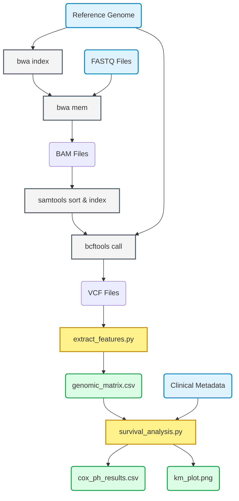
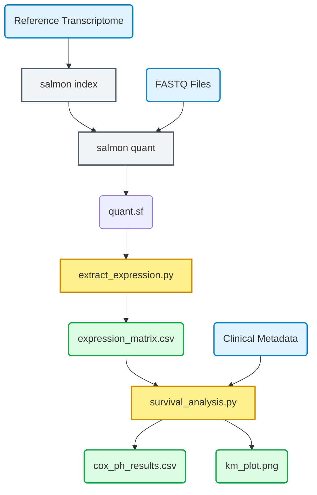

# Genomic Survival Analysis Pipeline

A reproducible, Snakemake-based bioinformatics workflow that connects raw Next-Generation Sequencing (NGS) data to clinical outcomes. This pipeline evaluates how genomic features (DNA mutations or RNA-Seq gene expression) influence survival rates using Cox Proportional Hazards models and Kaplan-Meier curves.

## Overview

This repository contains two parallel workflows:
1. **The Toy Pipeline (DNA Variants):** A lightweight, self-contained demonstration that simulates FASTQ files, maps reads (BWA), calls variants (BCFTools), and correlates the presence of mutations with survival.
2. **The Real Pipeline (RNA-Seq Expression):** A production-ready pipeline that quantifies transcripts (Salmon) and correlates continuous Transcripts Per Million (TPM) values with survival, stratifying cohorts by median expression.

---

## Project Structure

```text
├── data/                       # Raw FASTQ files, clinical.csv, and reference sequences
├── mapped/                     # Intermediate BAM files (Toy pipeline)
├── vcf/                        # Variant call files (Toy pipeline)
├── results/                    # Output statistical matrices, CSVs, and plots
│   └── quant/                  # Salmon quantification outputs (Real pipeline)
├── scripts/                    # Python scripts for the Toy pipeline
├── realdata_scripts/           # Python scripts and Snakefile for the RNA-Seq pipeline
├── environment.yaml            # Conda environment dependencies
├── Snakefile                   # Snakemake orchestrator for the Toy pipeline
└── README.md                   # Project documentation

```

---

## ⚙️ Installation & Dependencies

This pipeline relies on Conda/Mamba for reproducible package management.

**1. Create the environment**

```bash
conda env create -f environment.yaml
conda activate survival_ngs

```

*(Note: If you plan to generate workflow diagrams, ensure `graphviz` is installed on your system: `conda install -c conda-forge graphviz`)*

---

## 🚀 Usage: The Toy Pipeline (DNA Mutations)

This workflow generates dummy data to prove the statistical framework works out of the box.

**1. Generate Simulated Data**
Creates a tiny reference genome, clinical metadata, and toy FASTQ files for 6 patients.

```bash
python scripts/generate_toy_data.py

```

**2. Execute the Pipeline**
Runs BWA, Samtools, BCFTools, and the `lifelines` survival analysis.

```bash
snakemake --cores 1

```

---

## 🧬 Usage: The Real Pipeline (RNA-Seq Expression)

To analyze real RNA-Seq data, you must provide your own FASTQ files, a clinical CSV, and a reference transcriptome.

**1. Prepare Your Data**

* Place your patient `.fastq` files in `data/`.
* Place your reference `transcriptome.fasta` in `data/`.
* Update `data/clinical.csv` with real `sample`, `time` (duration), `status` (1=event, 0=censored), and `age` columns.

**2. Execute the Pipeline**
Point Snakemake to the specific RNA-Seq Snakefile.

```bash
snakemake -s realdata_scripts/Snakefile --cores all

```

---

## 📊 Outputs

Regardless of which pipeline you run, the final statistical outputs will be generated in the `results/` directory:

* **`genomic_matrix.csv` / `expression_matrix.csv`:** The extracted feature data (binary variant presence or continuous TPMs) merged for the cohort.
* **`cox_ph_results.csv`:** Hazard ratios, confidence intervals, and p-values generated by the Cox Proportional Hazards model.
* **`km_plot.png`:** Kaplan-Meier survival curves comparing cohorts (Mutated vs. Wildtype, or High vs. Low Expression).

---

## 🗺️ Generating a Workflow Diagram (DAG)

Snakemake can automatically generate a Directed Acyclic Graph (DAG) visualizing the steps in your pipeline.

Run this command in your terminal to generate a PNG image of the workflow:

```bash
# For the Toy Pipeline
snakemake --dag | dot -Tpng > workflow_toy.png

# For the RNA-Seq Pipeline
snakemake -s realdata_scripts/Snakefile --dag | dot -Tpng > workflow_rnaseq.png

```

### Alternatively: Save as a reusable bash script

You can save this as `generate_dag.sh` in your root directory and run it via `bash generate_dag.sh`:

```bash
#!/bin/bash
# generate_dag.sh

echo "Generating DAG for Toy Pipeline..."
snakemake --dag | dot -Tpng > workflow_toy.png

echo "Generating DAG for RNA-Seq Pipeline..."
snakemake -s realdata_scripts/Snakefile --dag | dot -Tpng > workflow_rnaseq.png

echo "Done! Images saved as workflow_toy.png and workflow_rnaseq.png."

```

# The Real Pipeline (RNA-Seq Expression)


